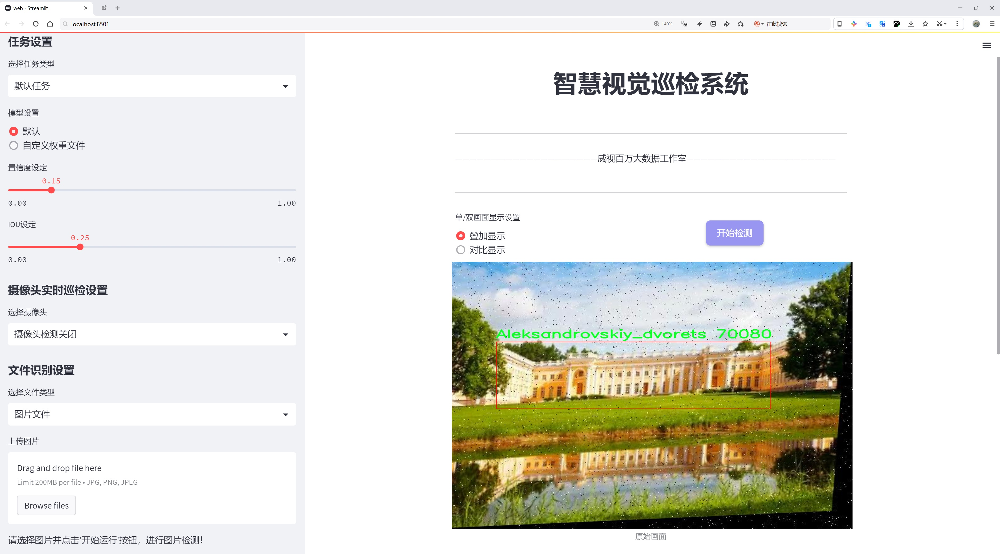
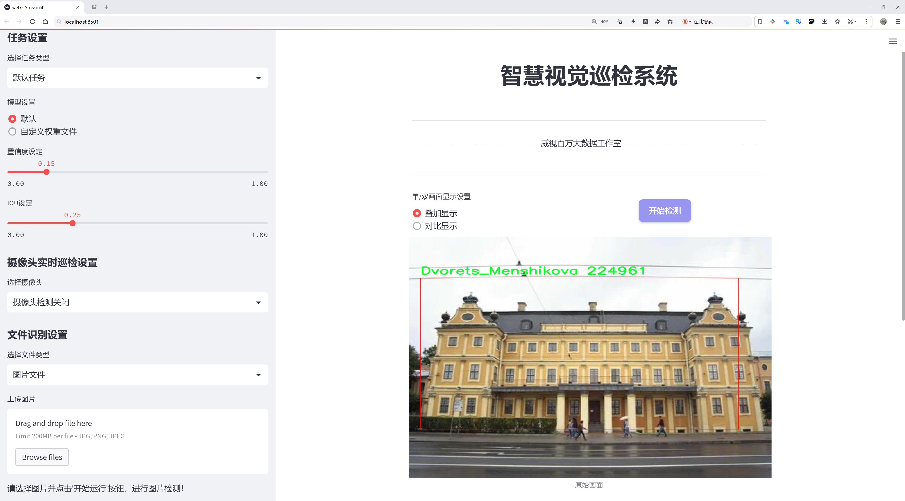
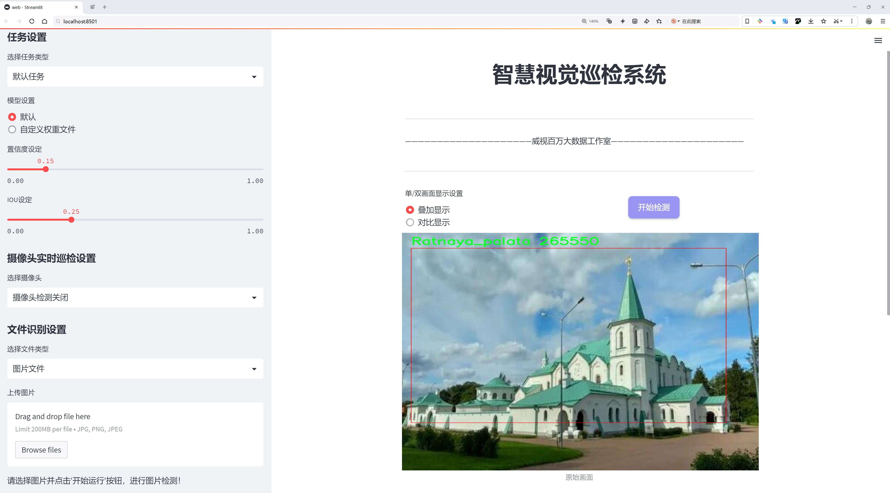
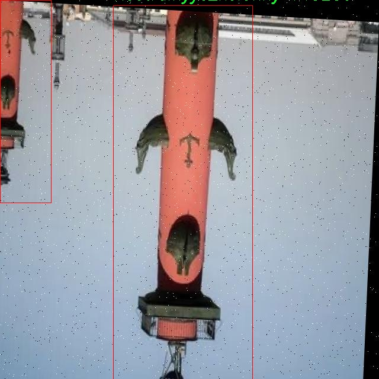
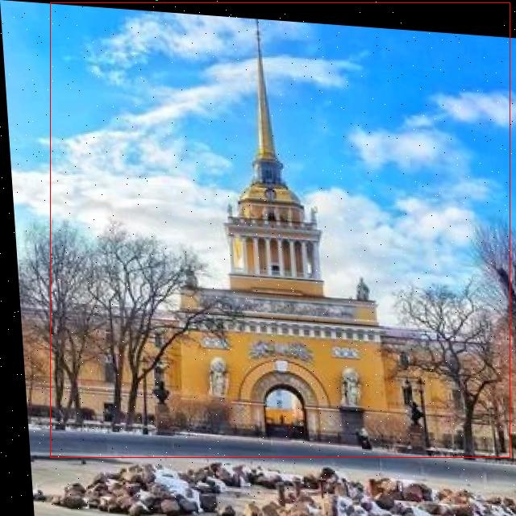
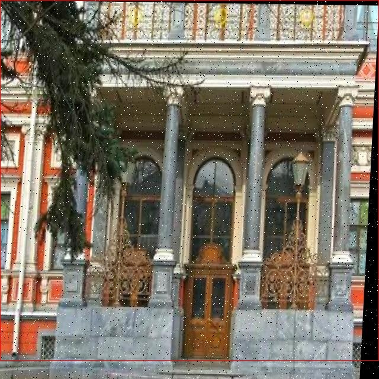
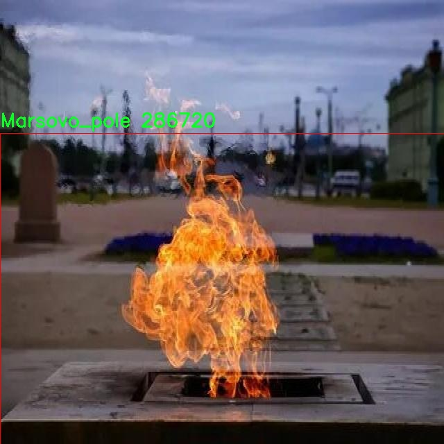
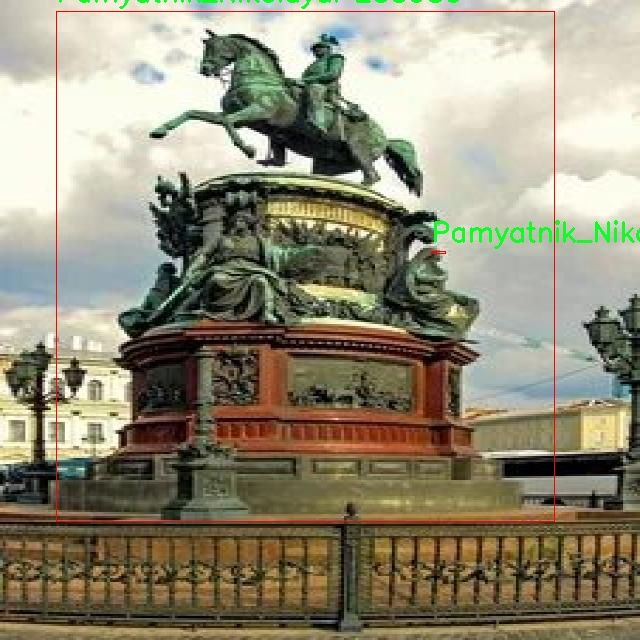

# 著名建筑物检测与识别检测系统源码分享
 # [一条龙教学YOLOV8标注好的数据集一键训练_70+全套改进创新点发刊_Web前端展示]

### 1.研究背景与意义

项目参考[AAAI Association for the Advancement of Artificial Intelligence](https://gitee.com/qunmasj/projects)

项目来源[AACV Association for the Advancement of Computer Vision](https://kdocs.cn/l/cszuIiCKVNis)

研究背景与意义

随着城市化进程的加快，建筑物的数量和种类日益增多，尤其是历史悠久的著名建筑物，它们不仅是城市文化的重要载体，也是旅游和经济发展的重要资源。因此，如何高效、准确地检测和识别这些建筑物，成为了计算机视觉领域中的一个重要研究课题。近年来，深度学习技术的迅猛发展为物体检测与识别提供了新的解决方案，尤其是YOLO（You Only Look Once）系列模型因其高效性和准确性，逐渐成为这一领域的主流方法。YOLOv8作为该系列的最新版本，具备了更强的特征提取能力和更快的推理速度，适合于实时检测任务。

本研究旨在基于改进的YOLOv8模型，构建一个针对著名建筑物的检测与识别系统。我们选取了包含4100张图像的SpbBuildings数据集，该数据集涵盖了49个类别的建筑物，包括著名的文化遗产和历史建筑，如彼得保罗要塞、冬宫、喀山大教堂等。这些建筑物不仅在视觉上具有显著的特征，而且在历史和文化上也承载着丰富的背景信息。通过对这些建筑物的检测与识别，不仅可以为城市管理和保护提供技术支持，还可以为旅游业的发展提供数据基础。

本研究的意义在于几个方面。首先，利用YOLOv8模型的优势，可以实现对建筑物的快速检测与准确识别，提升了传统方法在处理复杂场景时的效率和准确性。其次，基于改进的YOLOv8模型，能够有效地处理多类别建筑物的检测任务，为后续的智能城市建设和文化遗产保护提供了重要的技术支持。此外，通过对建筑物的自动检测与识别，可以为城市规划、旅游管理、文化传播等领域提供数据支持，推动相关产业的发展。

在实际应用中，该系统可以集成到智能手机应用或无人机监测系统中，实现对城市建筑物的实时监控与数据采集。这不仅有助于提升城市管理的智能化水平，还可以为游客提供更为丰富的文化体验和信息服务。通过对建筑物的识别与分析，游客可以更好地了解每一座建筑的历史背景和文化价值，从而增强旅游的趣味性和教育性。

综上所述，基于改进YOLOv8的著名建筑物检测与识别系统，不仅具有重要的学术价值，也具备广泛的应用前景。通过本研究，我们希望能够推动建筑物检测与识别技术的发展，为文化遗产的保护和城市管理提供更为有效的解决方案。

### 2.图片演示







##### 注意：由于此博客编辑较早，上面“2.图片演示”和“3.视频演示”展示的系统图片或者视频可能为老版本，新版本在老版本的基础上升级如下：（实际效果以升级的新版本为准）

  （1）适配了YOLOV8的“目标检测”模型和“实例分割”模型，通过加载相应的权重（.pt）文件即可自适应加载模型。

  （2）支持“图片识别”、“视频识别”、“摄像头实时识别”三种识别模式。

  （3）支持“图片识别”、“视频识别”、“摄像头实时识别”三种识别结果保存导出，解决手动导出（容易卡顿出现爆内存）存在的问题，识别完自动保存结果并导出到tempDir中。

  （4）支持Web前端系统中的标题、背景图等自定义修改，后面提供修改教程。

  另外本项目提供训练的数据集和训练教程,暂不提供权重文件（best.pt）,需要您按照教程进行训练后实现图片演示和Web前端界面演示的效果。

### 3.视频演示

[3.1 视频演示](https://www.bilibili.com/video/BV1UBsze2EQb/)

### 4.数据集信息展示

##### 4.1 本项目数据集详细数据（类别数＆类别名）

nc: 49
names: ['Admiralteystvo', 'Aleksandriyskaya_kolonna', 'Aleksandriyskiy_teatr', 'Aleksandrovskiy_dvorets', 'Anichkov_most', 'Apteka_doktoraPelya', 'Bankovskiy_most', 'Belaya_bashnya', 'Birzha', 'Chizhik-pyzhik', 'Dom_Vege', 'Dom_Zinger', 'Domik_PetraI', 'Dvenadtsat_Kollegiy', 'Dvorets_Menshikova', 'Dvortsovyy_most', 'Egipetskiye_vorota', 'Ekaterinenskiy_dvorets', 'Evangelichesko-lyuteranskiy_sobor', 'Hermitage', 'Ioannovskiy_stavropigialnyy_monastyr', 'Isaakiyevskiy', 'Kazanskiy_sobor', 'Kreyser_Avrora', 'Kunstkamera', 'Letniy_dvorets_Petra', 'Manezh', 'Mariinskiy_teatr', 'Marsovo_pole', 'Mednyy_vsadnik', 'Mikhaylovskiy_zamok', 'Muzey-dacha_Pushkina', 'Muzey_artillerii', 'Nikolayevskiy_dvorets', 'Novaya_Gollandiya', 'Pamyatnik_NikolayuI', 'Pamyatnik_PushkinaPush', 'Pamyatnik_PushkinaSpb', 'Pamyatnik_zaytsu', 'Petropavloskaya_krepost', 'Podvodnaya_lodkaC-189', 'Ratnaya_palata', 'Rostralnyye_kolonny', 'Russkiy_muzey', 'Skripuchaya_besedka', 'Sobornaya_mechet', 'Spas_na_krovi', 'Tsentralnyy_Voyenno-Morskoy_muzey', 'Yusupovskiy_dvorets']


##### 4.2 本项目数据集信息介绍

数据集信息展示

在现代计算机视觉领域，建筑物检测与识别的研究日益受到重视，尤其是在城市规划、文化遗产保护和旅游管理等方面，准确识别和分类著名建筑物具有重要的实际意义。本研究所使用的数据集“SpbBuildings”正是为此目的而构建，旨在为改进YOLOv8模型提供高质量的训练数据。该数据集包含49个类别，涵盖了圣彼得堡市内的众多著名建筑物，体现了丰富的历史文化内涵和独特的建筑风格。

“SpbBuildings”数据集的类别列表包括了从历史悠久的教堂到现代艺术博物馆的多样建筑，具体类别如“Admiralteystvo”（海军总司令部）、“Hermitage”（冬宫）、“Kazanskiy_sobor”（喀山大教堂）等。这些建筑不仅在视觉上具有独特的特征，而且在文化和历史上也承载着深厚的背景。例如，“Kreyser_Avrora”是俄罗斯历史上著名的巡洋舰，而“Mednyy_vsadnik”则是彼得大帝的铜像，象征着俄罗斯的崛起与辉煌。通过对这些建筑的检测与识别，研究者可以深入分析城市的历史演变、建筑风格的变迁以及其在现代社会中的意义。

数据集中的每个类别都经过精心标注，确保模型在训练过程中能够学习到建筑物的关键特征。这些特征不仅包括建筑的外观形态、颜色和材质，还涵盖了建筑在不同光照和天气条件下的表现。数据集的构建过程中，使用了多种拍摄角度和距离，以确保模型的鲁棒性和准确性。此外，数据集还考虑到了建筑物在不同季节和时间段的变化，使得模型能够适应多样化的应用场景。

在训练YOLOv8模型时，使用“SpbBuildings”数据集能够显著提高模型对建筑物的检测精度和识别能力。YOLOv8作为一种先进的目标检测算法，具备实时处理的能力，能够在复杂的环境中快速识别出目标。通过结合“SpbBuildings”数据集的丰富信息，模型将能够更好地理解建筑物的空间关系和结构特征，从而在实际应用中提供更为准确的检测结果。

综上所述，“SpbBuildings”数据集不仅为建筑物检测与识别提供了坚实的基础，还为相关领域的研究提供了丰富的数据支持。随着技术的不断进步和数据集的不断完善，未来在建筑物检测与识别方面的研究将会取得更大的突破，为城市管理、文化遗产保护和智能旅游等领域带来新的机遇与挑战。











### 5.全套项目环境部署视频教程（零基础手把手教学）

[5.1 环境部署教程链接（零基础手把手教学）](https://www.ixigua.com/7404473917358506534?logTag=c807d0cbc21c0ef59de5)


[5.2 安装Python虚拟环境创建和依赖库安装视频教程链接（零基础手把手教学）](https://www.ixigua.com/7404474678003106304?logTag=1f1041108cd1f708b01a)

### 6.手把手YOLOV8训练视频教程（零基础小白有手就能学会）

[6.1 手把手YOLOV8训练视频教程（零基础小白有手就能学会）](https://www.ixigua.com/7404477157818401292?logTag=d31a2dfd1983c9668658)

### 7.70+种全套YOLOV8创新点代码加载调参视频教程（一键加载写好的改进模型的配置文件）

[7.1 70+种全套YOLOV8创新点代码加载调参视频教程（一键加载写好的改进模型的配置文件）](https://www.ixigua.com/7404478314661806627?logTag=29066f8288e3f4eea3a4)

### 8.70+种全套YOLOV8创新点原理讲解（非科班也可以轻松写刊发刊，V10版本正在科研待更新）

由于篇幅限制，每个创新点的具体原理讲解就不一一展开，具体见下列网址中的创新点对应子项目的技术原理博客网址【Blog】：


[8.1 70+种全套YOLOV8创新点原理讲解链接](https://gitee.com/qunmasj/good)

### 9.系统功能展示（检测对象为举例，实际内容以本项目数据集为准）

图9.1.系统支持检测结果表格显示

  图9.2.系统支持置信度和IOU阈值手动调节

  图9.3.系统支持自定义加载权重文件best.pt(需要你通过步骤5中训练获得)

  图9.4.系统支持摄像头实时识别

  图9.5.系统支持图片识别

  图9.6.系统支持视频识别

  图9.7.系统支持识别结果文件自动保存

  图9.8.系统支持Excel导出检测结果数据


### 10.原始YOLOV8算法原理

原始YOLOv8算法原理

YOLOv8，作为2023年1月发布的最新一代目标检测模型，标志着计算机视觉领域的一次重要飞跃。它不仅在精度和执行时间上超越了前代模型，还融合了YOLO系列的众多设计优点，成为了实时目标检测和实例分割任务中的佼佼者。YOLOv8的推出，代表了对YOLOv5及其后续版本（如YOLOv6、YOLOX等）技术的深度整合与创新，形成了一种更为高效、灵活的检测架构。

YOLOv8的核心结构由三个主要部分组成：Backbone、Neck和Head。Backbone负责特征提取，Neck则用于特征融合，而Head则负责最终的目标检测与分类。YOLOv8在Backbone部分采用了CSPDarknet（Cross Stage Partial Darknet）结构，这一设计通过将特征图分为多个分支并进行处理，显著提升了模型的特征提取能力。具体而言，YOLOv8引入了C2f模块，替代了YOLOv5中的C3模块。C2f模块通过分支结构的设计，能够在不同的路径上并行处理特征，从而实现更丰富的特征表达。这种结构的优势在于，能够更好地捕捉到图像中的细节信息，尤其是在处理复杂场景时，模型的表现更加优异。

在特征融合方面，YOLOv8采用了快速空间金字塔池化（SPPF）结构，结合了特征金字塔网络（FPN）和路径聚合网络（PAN）的优势。SPPF通过对不同尺度的特征进行有效整合，能够在保持高精度的同时，显著减少模型的参数量和计算量。这种高效的特征融合策略，使得YOLOv8在处理高分辨率图像时，依然能够保持良好的性能，尤其是在小目标检测方面，YOLOv8展现出了强大的能力。

YOLOv8的另一个重要创新在于其检测头的设计。与YOLOv5的Anchor-Based检测方式不同，YOLOv8采用了Anchor-Free的检测策略。这一变化不仅简化了模型的结构，还提高了检测的速度和准确度。通过直接预测目标的中心点及其宽高比例，YOLOv8有效地减少了对Anchor框的依赖，降低了模型的复杂性。这种解耦的设计使得分类和回归任务可以独立进行，进一步提升了模型的灵活性和适应性。

此外，YOLOv8还引入了一种新的损失函数，这一创新在目标检测任务中具有重要意义。通过优化损失函数，YOLOv8能够更好地平衡分类和定位的精度，确保在各种场景下都能实现高效的目标检测。这种设计的灵活性使得YOLOv8能够在不同的硬件平台上运行，从CPU到GPU均能高效执行，适应性极强。

YOLOv8的设计理念不仅体现在技术创新上，还注重工程化的简洁易用性。与前代模型相比，YOLOv8在使用和部署上更加友好，降低了用户的学习成本。这一特性使得YOLOv8能够广泛应用于各类实际场景中，如智能监控、自动驾驶、无人机视觉等领域，展现出强大的实用价值。

综上所述，YOLOv8的原始算法原理体现了对目标检测技术的深刻理解与创新。通过对Backbone、Neck和Head的全面优化，YOLOv8不仅提升了模型的性能，还在实际应用中展现出极高的灵活性和适应性。作为YOLO系列的最新代表，YOLOv8无疑将推动目标检测技术的进一步发展，为相关领域带来新的机遇与挑战。


### 11.项目核心源码讲解（再也不用担心看不懂代码逻辑）

#### 11.1 code\ultralytics\utils\benchmarks.py

以下是对代码中最核心部分的分析和详细中文注释：

```python
import time
import numpy as np
import pandas as pd
from ultralytics import YOLO
from ultralytics.utils import select_device, check_requirements, check_yolo
from ultralytics.engine.exporter import export_formats

def benchmark(
    model='yolov8n.pt', data=None, imgsz=160, half=False, int8=False, device="cpu", verbose=False
):
    """
    对YOLO模型进行基准测试，评估不同格式下的速度和准确性。

    参数:
        model (str | Path | optional): 模型文件或目录的路径，默认为'yolov8n.pt'。
        data (str, optional): 用于评估的数据集，默认为None。
        imgsz (int, optional): 基准测试的图像大小，默认为160。
        half (bool, optional): 如果为True，则使用半精度模型，默认为False。
        int8 (bool, optional): 如果为True，则使用int8精度模型，默认为False。
        device (str, optional): 运行基准测试的设备，可以是'cpu'或'cuda'，默认为'cpu'。
        verbose (bool | float | optional): 如果为True或浮点数，则根据给定的指标断言基准测试通过，默认为False。

    返回:
        df (pandas.DataFrame): 包含每种格式的基准测试结果的DataFrame，包括文件大小、指标和推理时间。
    """
    
    # 设置pandas显示选项
    pd.options.display.max_columns = 10
    pd.options.display.width = 120
    
    # 选择设备
    device = select_device(device, verbose=False)
    
    # 加载模型
    model = YOLO(model) if isinstance(model, (str, Path)) else model

    results = []  # 存储结果
    start_time = time.time()  # 记录开始时间
    
    # 遍历导出格式
    for i, (name, format, suffix, cpu, gpu) in export_formats().iterrows():
        emoji, filename = "❌", None  # 默认导出状态
        try:
            # 检查导出格式的支持
            assert i != 9 or platform.system() == "Linux", "Edge TPU export only supported on Linux"
            if i in {5, 10}:  # CoreML和TF.js
                assert platform.system() in {"Darwin", "Linux"}, "export only supported on macOS and Linux"
            if "cpu" in device.type:
                assert cpu, "inference not supported on CPU"
            if "cuda" in device.type:
                assert gpu, "inference not supported on GPU"

            # 导出模型
            if format == "-":
                filename = model.ckpt_path or model.cfg  # PyTorch格式
                exported_model = model
            else:
                filename = model.export(imgsz=imgsz, format=format, half=half, int8=int8, device=device, verbose=False)
                exported_model = YOLO(filename, task=model.task)
                assert suffix in str(filename), "export failed"
            emoji = "✅"  # 导出成功

            # 进行预测
            exported_model.predict(ASSETS / "bus.jpg", imgsz=imgsz, device=device, half=half)

            # 验证模型
            data = data or TASK2DATA[model.task]  # 获取数据集
            key = TASK2METRIC[model.task]  # 获取指标
            results_dict = exported_model.val(
                data=data, batch=1, imgsz=imgsz, plots=False, device=device, half=half, int8=int8, verbose=False
            )
            metric, speed = results_dict.results_dict[key], results_dict.speed["inference"]
            results.append([name, "✅", round(file_size(filename), 1), round(metric, 4), round(speed, 2)])
        except Exception as e:
            LOGGER.warning(f"ERROR ❌️ Benchmark failure for {name}: {e}")
            results.append([name, emoji, round(file_size(filename), 1), None, None])  # 记录失败信息

    # 打印结果
    check_yolo(device=device)  # 打印系统信息
    df = pd.DataFrame(results, columns=["Format", "Status❔", "Size (MB)", key, "Inference time (ms/im)"])

    # 记录基准测试完成的信息
    log_message = f"\nBenchmarks complete for {model.ckpt_path.name} on {data} at imgsz={imgsz} ({time.time() - start_time:.2f}s)\n{df}\n"
    LOGGER.info(log_message)
    with open("benchmarks.log", "a", errors="ignore", encoding="utf-8") as f:
        f.write(log_message)

    return df  # 返回结果DataFrame
```

### 代码分析与注释
1. **导入模块**：导入必要的库和模块，包括时间、numpy、pandas和YOLO模型相关的模块。
2. **benchmark函数**：该函数用于对YOLO模型进行基准测试，评估不同格式下的速度和准确性。
3. **参数设置**：函数接受多个参数，包括模型路径、数据集、图像大小、精度设置、设备类型和详细程度。
4. **设备选择**：通过`select_device`函数选择运行基准测试的设备（CPU或GPU）。
5. **模型加载**：根据传入的模型路径加载YOLO模型。
6. **结果存储**：使用一个列表`results`来存储每种格式的测试结果。
7. **导出格式遍历**：遍历支持的导出格式，进行模型导出和预测。
8. **异常处理**：在导出和预测过程中，使用try-except块捕获异常，并记录错误信息。
9. **结果打印**：基准测试完成后，打印结果并将其写入日志文件。

这个函数的核心逻辑在于对不同格式的YOLO模型进行基准测试，记录每种格式的推理时间和准确性，并将结果以DataFrame的形式返回。

这个文件 `benchmarks.py` 是 Ultralytics YOLO 项目的一部分，主要用于对 YOLO 模型在不同格式下的速度和准确性进行基准测试。文件中包含了两个主要的功能：`benchmark` 函数和 `ProfileModels` 类。

首先，`benchmark` 函数的作用是对指定的 YOLO 模型进行基准测试。用户可以通过传入模型文件路径、数据集、图像大小、是否使用半精度或整型精度、设备类型（CPU 或 GPU）等参数来执行基准测试。函数会导出模型为不同的格式（如 PyTorch、ONNX、TensorRT 等），并对每种格式进行推理和验证，记录每种格式的文件大小、性能指标（如 mAP）和推理时间。最终，函数返回一个包含所有基准测试结果的 pandas DataFrame，并将结果记录到日志文件中。

其次，`ProfileModels` 类用于对多个模型进行性能分析。用户可以提供模型文件的路径，类会对每个模型进行速度和计算量（FLOPs）的评估。该类包含了多种方法，例如获取模型文件、获取 ONNX 模型信息、进行 TensorRT 和 ONNX 模型的性能分析等。分析结果以表格形式输出，便于用户比较不同模型的性能。

文件中还定义了一些辅助函数，例如 `iterative_sigma_clipping` 用于处理运行时间数据，确保结果的准确性，以及 `generate_table_row` 和 `generate_results_dict` 用于生成表格行和结果字典，便于展示模型的性能指标。

整体而言，这个文件为用户提供了一种方便的方式来评估和比较不同 YOLO 模型在不同格式下的性能，帮助用户选择最适合其需求的模型和格式。

#### 11.2 ui.py

```python
import sys
import subprocess

def run_script(script_path):
    """
    使用当前 Python 环境运行指定的脚本。

    Args:
        script_path (str): 要运行的脚本路径

    Returns:
        None
    """
    # 获取当前 Python 解释器的路径
    python_path = sys.executable

    # 构建运行命令，使用 streamlit 运行指定的脚本
    command = f'"{python_path}" -m streamlit run "{script_path}"'

    # 执行命令并等待其完成
    result = subprocess.run(command, shell=True)
    
    # 检查命令执行的返回码，如果不为0，表示执行出错
    if result.returncode != 0:
        print("脚本运行出错。")


# 主程序入口
if __name__ == "__main__":
    # 指定要运行的脚本路径
    script_path = "web.py"  # 假设脚本在当前目录下

    # 调用函数运行脚本
    run_script(script_path)
```

### 代码注释说明：
1. **导入模块**：
   - `sys`：用于获取当前 Python 解释器的路径。
   - `subprocess`：用于执行外部命令。

2. **`run_script` 函数**：
   - 功能：运行指定路径的 Python 脚本。
   - 参数：`script_path` 是要运行的脚本的路径。
   - 获取当前 Python 解释器的路径，以便可以在该环境中运行脚本。
   - 构建命令字符串，使用 `streamlit` 模块运行指定的脚本。
   - 使用 `subprocess.run` 执行命令，并等待其完成。
   - 检查命令的返回码，如果返回码不为0，表示脚本运行出错，打印错误信息。

3. **主程序入口**：
   - 检查是否是主程序运行，如果是，则指定要运行的脚本路径。
   - 调用 `run_script` 函数来执行指定的脚本。

这个程序文件的主要功能是通过当前的 Python 环境来运行一个指定的脚本，具体来说是运行一个名为 `web.py` 的脚本。文件首先导入了必要的模块，包括 `sys`、`os` 和 `subprocess`，以及一个自定义的 `abs_path` 函数，用于获取脚本的绝对路径。

在 `run_script` 函数中，首先获取当前 Python 解释器的路径，这通过 `sys.executable` 实现。接着，构建一个命令字符串，该命令使用 `streamlit` 模块来运行指定的脚本。`streamlit` 是一个用于构建数据应用的库，这里使用 `-m` 参数来运行模块。

然后，使用 `subprocess.run` 方法执行构建好的命令。这个方法会在一个新的进程中运行命令，并等待其完成。如果命令执行的返回码不为零，表示脚本运行出错，程序会打印出相应的错误信息。

在文件的最后部分，使用 `if __name__ == "__main__":` 语句来确保只有在直接运行该文件时才会执行下面的代码。这里指定了要运行的脚本路径，即 `web.py`，并调用 `run_script` 函数来执行该脚本。

总的来说，这个程序文件的作用是为运行一个 Streamlit 应用提供了一个简单的接口，确保在正确的 Python 环境中执行指定的脚本。

#### 11.3 code\ultralytics\nn\modules\conv.py

以下是代码中最核心的部分，并附上详细的中文注释：

```python
import math
import torch
import torch.nn as nn

def autopad(k, p=None, d=1):  # kernel, padding, dilation
    """自动填充以保持输出形状不变。"""
    if d > 1:
        # 如果膨胀率大于1，计算实际的卷积核大小
        k = d * (k - 1) + 1 if isinstance(k, int) else [d * (x - 1) + 1 for x in k]
    if p is None:
        # 如果没有指定填充，自动计算填充
        p = k // 2 if isinstance(k, int) else [x // 2 for x in k]
    return p

class Conv(nn.Module):
    """标准卷积层，包含输入通道、输出通道、卷积核大小、步幅、填充、分组、膨胀和激活函数的参数。"""

    default_act = nn.SiLU()  # 默认激活函数

    def __init__(self, c1, c2, k=1, s=1, p=None, g=1, d=1, act=True):
        """初始化卷积层，包含激活函数的参数。"""
        super().__init__()
        # 创建卷积层
        self.conv = nn.Conv2d(c1, c2, k, s, autopad(k, p, d), groups=g, dilation=d, bias=False)
        # 批归一化层
        self.bn = nn.BatchNorm2d(c2)
        # 激活函数
        self.act = self.default_act if act is True else act if isinstance(act, nn.Module) else nn.Identity()

    def forward(self, x):
        """对输入张量应用卷积、批归一化和激活函数。"""
        return self.act(self.bn(self.conv(x)))

class DWConv(Conv):
    """深度卷积层，适用于每个输入通道单独卷积。"""

    def __init__(self, c1, c2, k=1, s=1, d=1, act=True):
        """初始化深度卷积层，包含输入通道、输出通道、卷积核大小、步幅、膨胀和激活函数的参数。"""
        super().__init__(c1, c2, k, s, g=math.gcd(c1, c2), d=d, act=act)

class ConvTranspose(nn.Module):
    """转置卷积层。"""

    default_act = nn.SiLU()  # 默认激活函数

    def __init__(self, c1, c2, k=2, s=2, p=0, bn=True, act=True):
        """初始化转置卷积层，包含批归一化和激活函数。"""
        super().__init__()
        self.conv_transpose = nn.ConvTranspose2d(c1, c2, k, s, p, bias=not bn)
        self.bn = nn.BatchNorm2d(c2) if bn else nn.Identity()
        self.act = self.default_act if act is True else act if isinstance(act, nn.Module) else nn.Identity()

    def forward(self, x):
        """对输入应用转置卷积、批归一化和激活函数。"""
        return self.act(self.bn(self.conv_transpose(x)))

class ChannelAttention(nn.Module):
    """通道注意力模块。"""

    def __init__(self, channels: int) -> None:
        """初始化通道注意力模块，设置基本配置和实例变量。"""
        super().__init__()
        self.pool = nn.AdaptiveAvgPool2d(1)  # 自适应平均池化
        self.fc = nn.Conv2d(channels, channels, 1, 1, 0, bias=True)  # 1x1卷积
        self.act = nn.Sigmoid()  # 激活函数

    def forward(self, x: torch.Tensor) -> torch.Tensor:
        """应用前向传播，使用激活函数对输入进行卷积。"""
        return x * self.act(self.fc(self.pool(x)))

class SpatialAttention(nn.Module):
    """空间注意力模块。"""

    def __init__(self, kernel_size=7):
        """初始化空间注意力模块，指定卷积核大小。"""
        super().__init__()
        assert kernel_size in (3, 7), "卷积核大小必须为3或7"
        padding = 3 if kernel_size == 7 else 1
        self.cv1 = nn.Conv2d(2, 1, kernel_size, padding=padding, bias=False)  # 卷积层
        self.act = nn.Sigmoid()  # 激活函数

    def forward(self, x):
        """对输入应用通道和空间注意力进行特征重校准。"""
        return x * self.act(self.cv1(torch.cat([torch.mean(x, 1, keepdim=True), torch.max(x, 1, keepdim=True)[0]], 1)))

class CBAM(nn.Module):
    """卷积块注意力模块。"""

    def __init__(self, c1, kernel_size=7):
        """初始化CBAM模块，指定输入通道和卷积核大小。"""
        super().__init__()
        self.channel_attention = ChannelAttention(c1)  # 通道注意力
        self.spatial_attention = SpatialAttention(kernel_size)  # 空间注意力

    def forward(self, x):
        """通过CBAM模块进行前向传播。"""
        return self.spatial_attention(self.channel_attention(x))
```

### 代码说明
1. **autopad**: 自动计算填充，以保持卷积输出的形状与输入相同。
2. **Conv**: 标准卷积层，包含卷积、批归一化和激活函数。
3. **DWConv**: 深度卷积层，每个输入通道独立卷积。
4. **ConvTranspose**: 转置卷积层，常用于上采样。
5. **ChannelAttention**: 通道注意力模块，通过自适应平均池化和1x1卷积实现通道重标定。
6. **SpatialAttention**: 空间注意力模块，通过卷积和激活函数实现空间特征重标定。
7. **CBAM**: 结合通道和空间注意力的模块，增强特征表示能力。

这个程序文件定义了一系列用于卷积操作的模块，主要用于深度学习中的卷积神经网络（CNN）。文件中包含多个类和函数，下面是对其主要内容的说明。

首先，文件导入了必要的库，包括 `math`、`numpy` 和 `torch`，以及 `torch.nn` 模块。接着，定义了一个 `autopad` 函数，用于自动计算卷积操作的填充（padding）值，以确保输出的形状与输入相同。

接下来，定义了多个卷积相关的类。`Conv` 类是一个标准的卷积层，包含卷积操作、批归一化（Batch Normalization）和激活函数。它的构造函数接受多个参数，如输入通道数、输出通道数、卷积核大小、步幅、填充、分组数和扩张率。`forward` 方法实现了前向传播过程，依次应用卷积、批归一化和激活函数。

`Conv2` 类是对 `Conv` 类的简化，增加了一个 1x1 的卷积层，并在前向传播中将两个卷积的输出相加。`LightConv` 类实现了一种轻量级卷积，使用了深度卷积（Depth-wise Convolution）和标准卷积的组合。

`DWConv` 类实现了深度卷积，适用于通道数较大的情况。`DWConvTranspose2d` 类则是深度卷积的转置版本。`ConvTranspose` 类实现了转置卷积，支持批归一化和激活函数。

`Focus` 类用于将空间信息聚焦到通道维度，通过对输入张量进行拼接和卷积操作来实现。`GhostConv` 类实现了一种称为“幽灵卷积”的方法，能够有效减少计算量。

`RepConv` 类实现了一种可重用的卷积模块，支持训练和推理状态的转换。它可以将多个卷积层融合为一个，以提高推理效率。

接下来是注意力机制相关的模块。`ChannelAttention` 类实现了通道注意力机制，通过对输入特征图进行全局平均池化后，使用一个全连接层来生成通道权重。`SpatialAttention` 类实现了空间注意力机制，通过对输入特征图进行平均和最大池化后，使用卷积层生成空间权重。

`CBAM` 类则结合了通道注意力和空间注意力，形成一个完整的卷积块注意力模块。最后，`Concat` 类用于在指定维度上拼接多个张量。

总体来说，这个文件提供了一系列灵活且高效的卷积模块和注意力机制，适用于构建各种深度学习模型，尤其是在目标检测和图像处理等任务中。

#### 11.4 train.py

以下是经过简化和注释的核心代码部分，主要保留了与YOLO检测模型训练相关的功能：

```python
import random
import numpy as np
import torch.nn as nn
from ultralytics.data import build_dataloader, build_yolo_dataset
from ultralytics.engine.trainer import BaseTrainer
from ultralytics.models import yolo
from ultralytics.nn.tasks import DetectionModel
from ultralytics.utils import LOGGER, RANK
from ultralytics.utils.torch_utils import de_parallel, torch_distributed_zero_first

class DetectionTrainer(BaseTrainer):
    """
    扩展自BaseTrainer类，用于基于检测模型的训练。
    """

    def build_dataset(self, img_path, mode="train", batch=None):
        """
        构建YOLO数据集。

        参数:
            img_path (str): 包含图像的文件夹路径。
            mode (str): 模式，`train`或`val`，用户可以为每种模式自定义不同的增强。
            batch (int, optional): 批次大小，仅用于`rect`模式。默认为None。
        """
        gs = max(int(de_parallel(self.model).stride.max() if self.model else 0), 32)
        return build_yolo_dataset(self.args, img_path, batch, self.data, mode=mode, rect=mode == "val", stride=gs)

    def get_dataloader(self, dataset_path, batch_size=16, rank=0, mode="train"):
        """构造并返回数据加载器。"""
        assert mode in ["train", "val"]
        with torch_distributed_zero_first(rank):  # 仅在DDP中初始化数据集*.cache一次
            dataset = self.build_dataset(dataset_path, mode, batch_size)
        shuffle = mode == "train"  # 训练模式下打乱数据
        workers = self.args.workers if mode == "train" else self.args.workers * 2
        return build_dataloader(dataset, batch_size, workers, shuffle, rank)  # 返回数据加载器

    def preprocess_batch(self, batch):
        """对图像批次进行预处理，包括缩放和转换为浮点数。"""
        batch["img"] = batch["img"].to(self.device, non_blocking=True).float() / 255  # 归一化图像
        if self.args.multi_scale:  # 如果启用多尺度
            imgs = batch["img"]
            sz = (
                random.randrange(self.args.imgsz * 0.5, self.args.imgsz * 1.5 + self.stride)
                // self.stride
                * self.stride
            )  # 随机选择图像大小
            sf = sz / max(imgs.shape[2:])  # 计算缩放因子
            if sf != 1:
                ns = [
                    math.ceil(x * sf / self.stride) * self.stride for x in imgs.shape[2:]
                ]  # 计算新的形状
                imgs = nn.functional.interpolate(imgs, size=ns, mode="bilinear", align_corners=False)  # 调整图像大小
            batch["img"] = imgs
        return batch

    def get_model(self, cfg=None, weights=None, verbose=True):
        """返回YOLO检测模型。"""
        model = DetectionModel(cfg, nc=self.data["nc"], verbose=verbose and RANK == -1)
        if weights:
            model.load(weights)  # 加载权重
        return model

    def plot_training_samples(self, batch, ni):
        """绘制带有注释的训练样本。"""
        plot_images(
            images=batch["img"],
            batch_idx=batch["batch_idx"],
            cls=batch["cls"].squeeze(-1),
            bboxes=batch["bboxes"],
            paths=batch["im_file"],
            fname=self.save_dir / f"train_batch{ni}.jpg",
            on_plot=self.on_plot,
        )

    def plot_metrics(self):
        """从CSV文件绘制指标。"""
        plot_results(file=self.csv, on_plot=self.on_plot)  # 保存结果图
```

### 代码注释说明：
1. **build_dataset**: 构建YOLO数据集，支持训练和验证模式，允许自定义增强。
2. **get_dataloader**: 创建数据加载器，支持多进程和数据打乱。
3. **preprocess_batch**: 对输入的图像批次进行预处理，包括归一化和可选的多尺度调整。
4. **get_model**: 返回YOLO检测模型，并可选择加载预训练权重。
5. **plot_training_samples**: 绘制训练样本及其注释，便于可视化训练过程。
6. **plot_metrics**: 从CSV文件中绘制训练指标，便于分析模型性能。

这个程序文件 `train.py` 是一个用于训练目标检测模型的脚本，主要基于 YOLO（You Only Look Once）架构。它继承自 `BaseTrainer` 类，提供了一系列方法来构建数据集、加载数据、预处理图像、设置模型属性、获取模型、验证模型、记录损失、显示训练进度以及绘制训练样本和指标。

首先，程序导入了必要的库和模块，包括数学运算、随机数生成、深度学习框架 PyTorch 相关的模块，以及 Ultralytics 提供的数据处理和模型训练工具。

在 `DetectionTrainer` 类中，`build_dataset` 方法用于构建 YOLO 数据集，接受图像路径、模式（训练或验证）和批次大小作为参数。它会根据模型的步幅（stride）来调整数据集的构建方式。

`get_dataloader` 方法则负责构建并返回数据加载器。它会根据训练或验证模式来决定是否打乱数据，并设置工作线程的数量。

`preprocess_batch` 方法用于对图像批次进行预处理，包括将图像缩放到合适的大小并转换为浮点数格式。这里还支持多尺度训练，即在每个训练批次中随机选择图像的大小。

`set_model_attributes` 方法用于设置模型的属性，例如类别数量和类别名称等。这些属性会在模型训练时使用。

`get_model` 方法返回一个 YOLO 检测模型，支持加载预训练权重。

`get_validator` 方法返回一个用于模型验证的 `DetectionValidator` 实例，能够计算并记录损失。

`label_loss_items` 方法用于返回带有标签的训练损失字典，方便记录和监控训练过程中的损失情况。

`progress_string` 方法生成一个格式化的字符串，显示训练进度，包括当前的 epoch、GPU 内存使用情况、损失值、实例数量和图像大小等信息。

`plot_training_samples` 方法用于绘制训练样本及其标注，便于可视化训练过程中的数据。

最后，`plot_metrics` 和 `plot_training_labels` 方法分别用于绘制训练过程中的指标和创建带标签的训练图，帮助用户分析模型的训练效果。

整体来看，这个文件提供了一个完整的框架，用于训练 YOLO 模型并监控其性能，适合在目标检测任务中使用。

#### 11.5 70+种YOLOv8算法改进源码大全和调试加载训练教程（非必要）\ultralytics\engine\model.py

以下是代码中最核心的部分，并附上详细的中文注释：

```python
import torch
from pathlib import Path
from typing import Union
from ultralytics.nn.tasks import attempt_load_one_weight, guess_model_task, nn
from ultralytics.utils import LOGGER, checks

class Model(nn.Module):
    """
    统一所有模型API的基类。

    参数:
        model (str, Path): 要加载或创建的模型文件路径。
        task (Any, optional): YOLO模型的任务类型。默认为None。
    """

    def __init__(self, model: Union[str, Path] = 'yolov8n.pt', task=None) -> None:
        """
        初始化YOLO模型。

        参数:
            model (Union[str, Path], optional): 要加载或创建的模型路径或名称。默认为'yolov8n.pt'。
            task (Any, optional): YOLO模型的任务类型。默认为None。
        """
        super().__init__()
        self.model = None  # 模型对象
        self.task = task  # 任务类型
        model = str(model).strip()  # 去除空格

        # 检查是否为Ultralytics HUB模型
        if self.is_hub_model(model):
            from ultralytics.hub.session import HUBTrainingSession
            self.session = HUBTrainingSession(model)
            model = self.session.model_file

        # 加载或创建新的YOLO模型
        suffix = Path(model).suffix
        if suffix in ('.yaml', '.yml'):
            self._new(model, task)  # 从配置文件创建新模型
        else:
            self._load(model, task)  # 从权重文件加载模型

    def _new(self, cfg: str, task=None):
        """
        初始化新模型并从模型定义推断任务类型。

        参数:
            cfg (str): 模型配置文件
            task (str | None): 模型任务
        """
        cfg_dict = yaml_model_load(cfg)  # 加载YAML配置
        self.task = task or guess_model_task(cfg_dict)  # 推断任务类型
        self.model = self._smart_load('model')(cfg_dict)  # 创建模型

    def _load(self, weights: str, task=None):
        """
        从权重文件加载模型并推断任务类型。

        参数:
            weights (str): 要加载的模型检查点
            task (str | None): 模型任务
        """
        self.model, self.ckpt = attempt_load_one_weight(weights)  # 加载权重
        self.task = self.model.args['task']  # 获取任务类型

    def predict(self, source=None, stream=False, **kwargs):
        """
        使用YOLO模型进行预测。

        参数:
            source (str | int | PIL | np.ndarray): 要进行预测的图像源。
            stream (bool): 是否流式传输预测结果。默认为False。

        返回:
            (List[ultralytics.engine.results.Results]): 预测结果。
        """
        if source is None:
            LOGGER.warning("WARNING ⚠️ 'source' is missing.")  # 如果没有提供源，发出警告

        # 设置预测参数
        custom = {'conf': 0.25}  # 默认置信度
        args = {**self.overrides, **custom, **kwargs}  # 合并参数

        # 创建预测器并进行预测
        self.predictor = self._smart_load('predictor')(overrides=args)
        return self.predictor(source=source, stream=stream)

    @staticmethod
    def is_hub_model(model):
        """检查提供的模型是否为HUB模型。"""
        return model.startswith('https://hub.ultralytics.com/models/')  # 检查是否为HUB模型的URL

    def _smart_load(self, key):
        """加载模型/训练器/验证器/预测器。"""
        try:
            return self.task_map[self.task][key]  # 根据任务类型加载相应的组件
        except Exception as e:
            raise NotImplementedError(f"模型不支持此任务类型: {self.task}") from e

    @property
    def task_map(self):
        """返回任务到模型、训练器、验证器和预测器类的映射。"""
        raise NotImplementedError('请为您的模型提供任务映射！')
```

### 代码说明
1. **类的定义**：`Model`类继承自`nn.Module`，用于统一YOLO模型的API。
2. **初始化方法**：`__init__`方法用于初始化模型，可以从指定的文件加载模型或创建新模型。
3. **模型加载**：`_load`和`_new`方法分别用于从权重文件加载模型和从配置文件创建新模型。
4. **预测方法**：`predict`方法用于进行对象检测，接受图像源并返回预测结果。
5. **HUB模型检查**：`is_hub_model`方法用于检查模型是否为Ultralytics HUB模型。
6. **智能加载**：`_smart_load`方法根据任务类型加载相应的组件。
7. **任务映射**：`task_map`属性用于定义任务与模型、训练器、验证器和预测器的映射关系。

这个程序文件是一个用于YOLOv8模型的基础类`Model`的实现，主要用于统一不同模型的API。文件中导入了多个必要的库和模块，包括PyTorch、路径处理、类型提示等。类的构造函数接收模型文件的路径或名称，以及任务类型作为参数，并根据这些信息初始化模型。

在构造函数中，首先调用父类的构造函数，然后初始化一些属性，如回调函数、预测器、模型对象、训练器、检查点等。接着，通过判断模型的类型（如Ultralytics HUB模型或Triton Server模型），决定如何加载模型。如果模型是以`.yaml`或`.yml`格式提供的，则调用`_new`方法来初始化新模型；如果是以`.pt`格式提供的，则调用`_load`方法加载模型。

该类还定义了一些方法，允许用户进行模型的预测、训练、验证、导出等操作。`__call__`方法使得该类的实例可以像函数一样被调用，实际上是调用了`predict`方法进行对象检测。`predict`方法接受图像源和其他参数，使用YOLO模型进行预测，并返回预测结果。

此外，类中还有一些辅助方法，例如`_check_is_pytorch_model`用于检查模型是否为PyTorch模型，`reset_weights`用于重置模型参数，`info`用于记录模型信息，`fuse`用于融合模型层以加快推理速度等。

在训练模型时，`train`方法会根据传入的参数和配置进行训练，并在训练完成后更新模型和配置。`val`方法用于在给定数据集上验证模型，`benchmark`方法用于在所有导出格式上基准测试模型，`export`方法用于导出模型。

类中还提供了对超参数调优的支持，用户可以通过`tune`方法进行超参数搜索。此外，类还支持回调函数的添加、清除和重置，便于在训练和推理过程中进行自定义操作。

最后，类中定义了一些属性方法，如`names`、`device`和`transforms`，用于获取模型的类名、设备信息和变换信息等。整体来看，这个类为YOLOv8模型的使用提供了一个灵活且统一的接口，方便用户进行各种操作。

#### 11.6 code\ultralytics\nn\__init__.py

```python
# 导入必要的模型和函数
from .tasks import (
    BaseModel,               # 基础模型类
    ClassificationModel,     # 分类模型类
    DetectionModel,          # 检测模型类
    SegmentationModel,       # 分割模型类
    attempt_load_one_weight, # 尝试加载单个权重
    attempt_load_weights,    # 尝试加载多个权重
    guess_model_scale,       # 猜测模型的缩放比例
    guess_model_task,        # 猜测模型的任务类型
    parse_model,             # 解析模型结构
    torch_safe_load,         # 安全加载PyTorch模型
    yaml_model_load,         # 从YAML文件加载模型
)

# 定义模块的公开接口
__all__ = (
    "attempt_load_one_weight",  # 公开加载单个权重的函数
    "attempt_load_weights",      # 公开加载多个权重的函数
    "parse_model",               # 公开解析模型的函数
    "yaml_model_load",           # 公开从YAML文件加载模型的函数
    "guess_model_task",          # 公开猜测模型任务的函数
    "guess_model_scale",         # 公开猜测模型缩放比例的函数
    "torch_safe_load",           # 公开安全加载PyTorch模型的函数
    "DetectionModel",            # 公开检测模型类
    "SegmentationModel",         # 公开分割模型类
    "ClassificationModel",       # 公开分类模型类
    "BaseModel",                 # 公开基础模型类
)
```

### 代码核心部分及注释说明：

1. **导入模块**：
   - 通过 `from .tasks import (...)` 导入了一系列模型类和函数，这些是构建和使用YOLO模型所需的核心组件。

2. **模型类**：
   - `BaseModel`、`ClassificationModel`、`DetectionModel`、`SegmentationModel` 是不同类型的模型类，分别用于基础模型、分类、检测和分割任务。

3. **功能函数**：
   - `attempt_load_one_weight` 和 `attempt_load_weights` 用于加载模型权重，前者加载单个权重，后者加载多个权重。
   - `guess_model_scale` 和 `guess_model_task` 用于推测模型的缩放比例和任务类型。
   - `parse_model` 用于解析模型的结构。
   - `torch_safe_load` 用于安全地加载PyTorch模型，避免潜在的错误。
   - `yaml_model_load` 用于从YAML文件中加载模型配置。

4. **公开接口**：
   - `__all__` 定义了模块的公开接口，只有在这个列表中的名称可以被外部访问，其他名称则被视为私有。这有助于控制模块的使用和维护。

这个程序文件是Ultralytics YOLO项目的一部分，主要用于定义和导入与模型相关的功能和类。文件的开头包含了一个版权声明，表明该代码遵循AGPL-3.0许可证。

在文件中，首先从同一目录下的`tasks`模块导入了一系列的类和函数。这些导入的内容包括不同类型的模型类，如`BaseModel`、`ClassificationModel`、`DetectionModel`和`SegmentationModel`，这些类分别用于基础模型、分类模型、检测模型和分割模型的定义和操作。此外，还导入了一些与模型权重加载和解析相关的函数，例如`attempt_load_one_weight`、`attempt_load_weights`、`parse_model`、`yaml_model_load`、`torch_safe_load`等。这些函数的作用是帮助用户加载模型权重、解析模型结构以及处理与PyTorch相关的操作。

文件的最后部分定义了`__all__`变量，这是一个特殊的变量，用于指定当使用`from module import *`语句时，哪些名称会被导入。通过定义`__all__`，可以控制模块的公共接口，确保用户只访问到那些经过精心挑选的类和函数，从而提高代码的可维护性和可读性。

总的来说，这个文件是Ultralytics YOLO库的核心组成部分之一，负责组织和提供与模型相关的功能，方便用户进行模型的创建、加载和使用。

### 12.系统整体结构（节选）

### 整体功能和构架概括

Ultralytics YOLO项目是一个用于目标检测和图像处理的深度学习框架，基于YOLO（You Only Look Once）架构。该项目提供了一系列模块和工具，旨在简化模型的训练、验证和推理过程。整体架构包括模型定义、数据处理、损失计算、性能评估和用户界面等多个方面。

1. **模型定义**：通过不同的模块（如`model.py`和`conv.py`）定义了多种模型架构，包括基础模型、检测模型、分割模型等，并实现了卷积层和注意力机制的功能。
2. **训练与验证**：`train.py`文件提供了训练模型的接口，支持数据加载、预处理、训练过程监控和模型验证。
3. **性能评估**：`benchmarks.py`文件用于基准测试模型的性能，评估不同格式下的速度和准确性。
4. **数据处理**：通过`dataset.py`和其他工具模块，提供了数据集的构建和处理功能，确保训练数据的质量和格式。
5. **损失计算与指标评估**：`loss.py`和`metrics.py`文件用于定义损失函数和评估指标，帮助监控模型的训练效果。
6. **用户界面**：`ui.py`文件提供了一个简单的用户界面，用于运行模型和可视化结果。

以下是每个文件的功能整理表格：

| 文件路径                                                                                   | 功能描述                                                                                   |
|------------------------------------------------------------------------------------------|------------------------------------------------------------------------------------------|
| `code\ultralytics\utils\benchmarks.py`                                                  | 提供模型基准测试功能，评估不同格式下的速度和准确性。                                       |
| `ui.py`                                                                                   | 提供用户界面，允许用户运行指定的Streamlit脚本以可视化模型结果。                           |
| `code\ultralytics\nn\modules\conv.py`                                                   | 定义卷积层及其变种，包括标准卷积、深度卷积、转置卷积等，支持注意力机制。                   |
| `train.py`                                                                                | 提供训练YOLO模型的接口，包括数据加载、预处理、训练监控和验证功能。                       |
| `code\ultralytics\engine\model.py`                                                      | 定义YOLO模型的基础类，提供模型加载、预测、训练、验证和导出等功能。                       |
| `code\ultralytics\nn\__init__.py`                                                       | 导入与模型相关的类和函数，组织模块接口，控制公共API。                                     |
| `70+种YOLOv8算法改进源码大全和调试加载训练教程（非必要）\ultralytics\models\sam\build.py` | 实现SAM（Segment Anything Model）模型的构建和初始化功能。                                |
| `code\ultralytics\models\utils\loss.py`                                                 | 定义损失函数，帮助计算模型训练过程中的损失值。                                           |
| `code\ultralytics\utils\metrics.py`                                                     | 提供评估指标的计算功能，用于监控模型性能和训练效果。                                     |
| `70+种YOLOv8算法改进源码大全和调试加载训练教程（非必要）\ultralytics\nn\modules\transformer.py` | 实现Transformer模块，可能用于增强模型的特征提取能力。                                    |
| `code\ultralytics\utils\torch_utils.py`                                                 | 提供与PyTorch相关的工具函数，支持模型的训练和推理过程。                                   |
| `70+种YOLOv8算法改进源码大全和调试加载训练教程（非必要）\ultralytics\data\dataset.py`  | 定义数据集的构建和处理功能，确保训练数据的质量和格式。                                   |
| `70+种YOLOv8算法改进源码大全和调试加载训练教程（非必要）\ultralytics\models\yolo\__init__.py` | 导入YOLO模型相关的类和函数，组织YOLO模型的公共接口。                                     |

这个表格概述了每个文件的主要功能，帮助理解Ultralytics YOLO项目的整体架构和模块化设计。

注意：由于此博客编辑较早，上面“11.项目核心源码讲解（再也不用担心看不懂代码逻辑）”中部分代码可能会优化升级，仅供参考学习，完整“训练源码”、“Web前端界面”和“70+种创新点源码”以“13.完整训练+Web前端界面+70+种创新点源码、数据集获取”的内容为准。

### 13.完整训练+Web前端界面+70+种创新点源码、数据集获取


# [下载链接：https://mbd.pub/o/bread/ZpuZlpZv](https://mbd.pub/o/bread/ZpuZlpZv)